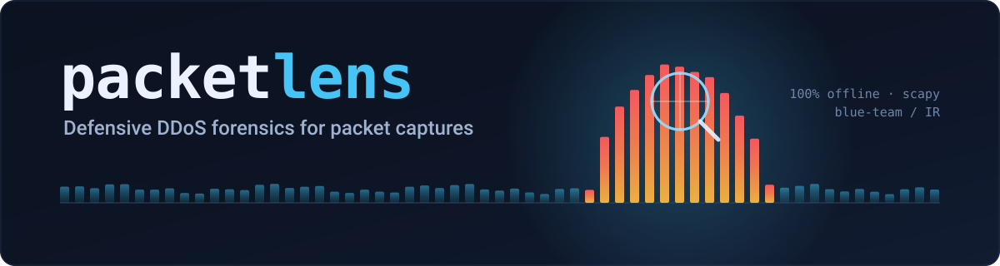
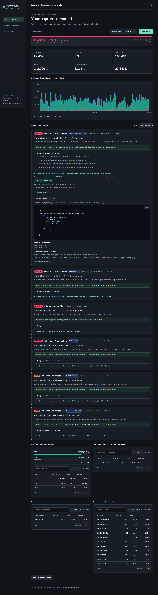
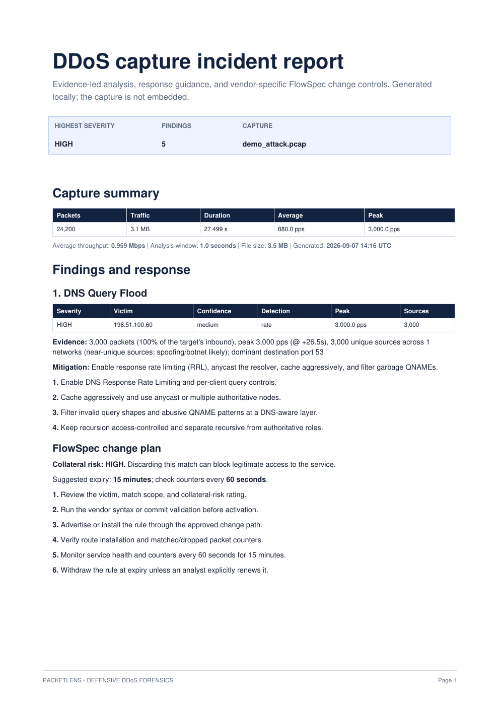
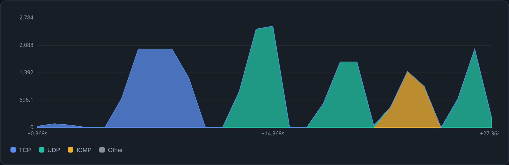
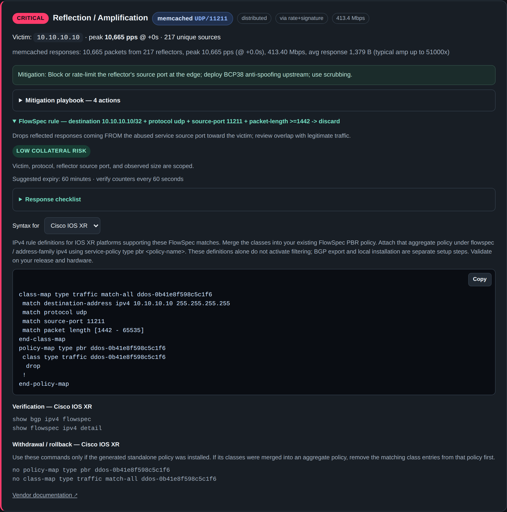

<div align="center">



<br>


**Read a packet capture, flag the DDoS, and hand the analyst a mitigation playbook — all on localhost.**

[Quick start](#-quick-start)&nbsp;·&nbsp;[What it detects](#-what-it-detects)&nbsp;·&nbsp;[Screenshots](#-screenshots)&nbsp;·&nbsp;[Install](#-installation)&nbsp;·&nbsp;[CLI](#-commandline-usage)&nbsp;·&nbsp;[Dashboard](#-web-dashboard)&nbsp;·&nbsp;[Validation](#-validation)&nbsp;·&nbsp;[License](#-license)

</div>

---

Packetlens is a heuristic, **defensive** forensic tool that reads a packet
capture and flags indicators of DDoS attacks — floods, reflection/amplification,
and crafted‑packet attacks. It ships as a command‑line analyzer and a local web
dashboard.

It is an **offline analysis** tool for blue‑team / incident‑response work. It does
not generate traffic and is not an inline mitigation device.

> [!NOTE]
> All analysis runs locally with [scapy](https://scapy.net). Nothing is uploaded
> anywhere — no database, cloud account, or API key is involved.

<div align="center">



</div>

The dashboard turns a PCAP into ranked findings, traffic timelines, searchable
source/destination/protocol inventories, mitigation playbooks, and reviewable
FlowSpec proposals. It can export the complete result as JSON or generate a
printable incident PDF locally.

<div align="center">

<table>
<tr>
<td width="33%" valign="top">

### 🔎 Two detection modes
Volumetric **rate** detection over sliding windows, plus rate‑independent attack
**signatures** — so short bursts and anonymized one‑way samples both get caught.

</td>
<td width="33%" valign="top">

### 🛡️ Actionable mitigation
Every finding carries a vendor‑neutral **playbook** and, where safe, a victim‑scoped
**BGP FlowSpec** rule for ExaBGP / Junos / IOS XR.

</td>
<td width="33%" valign="top">

### 🔒 100% local
No uploads, no accounts, no external calls. Binds to `127.0.0.1`, deletes uploads
after analysis, and works fully **air‑gapped**.

</td>
</tr>
</table>

</div>

<details>
<summary><b>📄 PDF report preview</b></summary>

<br>

<div align="center">

</div>

</details>

---

## 🚀 Quick start

```bash
# 1. Get the code
git clone https://github.com/narey83/packetlens.git
cd packetlens

# 2. Create an isolated environment and install dependencies
python3 -m venv .venv
.venv/bin/python -m pip install --upgrade pip
.venv/bin/python -m pip install -r requirements.txt

# 3. Launch the dashboard
.venv/bin/python webapp.py
```

Open <http://127.0.0.1:8000>, then drop in a `.pcap` or `.pcapng`. You can also
choose **Try a demo capture** to explore the complete workflow without supplying
a capture.

> [!TIP]
> Prefer SSH? `git clone git@github.com:narey83/packetlens.git`
> CLI only, no dashboard? After cloning, `.venv/bin/python ddos_analyzer.py capture.pcap`.

---

## 🔍 What it detects

Two complementary detection modes run in a single streaming pass:

- **Volumetric (rate) detection** — peak packets‑per‑second per victim, measured
  over sliding time windows (not just whole‑capture averages, so short bursts are
  caught).
- **Signature detection** — rate‑independent attack *fingerprints*. Many real
  captures are anonymized, filtered, **one‑way** samples: the whole file is the
  attack aimed at one victim, but only at sample rates. Signature mode fires on
  the pattern even when volume never approaches the pps thresholds; rate then only
  *escalates* severity.

Detected classes:

| Class | Notes |
|-------|-------|
| TCP SYN / ACK / RST / FIN floods | SYN flood reports the SYN‑ACK/SYN ratio (half‑open) |
| TCP SYN‑ACK reflection | unsolicited SYN‑ACKs from many servers |
| UDP floods | generic, plus DNS query floods |
| ICMP floods | |
| IP fragmentation floods | IPv4 MF/offset or IPv6 Fragment header |
| Reflection / amplification | ~24 reflector services by source port (NTP, DNS, memcached, CLDAP, SNMP, SSDP, chargen, ISAKMP, UBNT, DVR/IoT 37810, BACnet, …) with observed avg response size |
| Crafted packets (`sport == dport`) | LAND‑style / spoofing signature |
| Malformed packets (UDP port 0) | always invalid |
| Non‑standard IP protocol | crafted/random IP protocol‑field floods |

Each finding includes the victim, peak & average pps, unique source count,
distributed‑vs‑single‑source classification, how it was detected (`rate`,
`signature`, or `rate+signature`), a **confidence** (`high`/`medium`), a
severity, and a short mitigation hint.

Each detector also supplies an ordered, vendor-neutral **mitigation playbook**
covering immediate containment, service hardening, upstream response, and key
collateral-risk checks. The playbook is included in CLI and JSON output and is
expandable on each dashboard finding.

For findings that can be expressed safely, the analyzer also produces a
victim-scoped **BGP FlowSpec** discard rule in ExaBGP syntax. Rules are narrowed
by protocol, TCP flags, reflector source port, or a dominant destination port
when the evidence supports it. Signatures that FlowSpec cannot express safely
(such as `sport == dport`, unspecified non-standard protocols, and stateless
ACK filtering) are explicitly marked unsupported instead of producing an
over-broad rule. Review and time-limit every generated rule before advertising
it.

Severity: `LOW` → `MEDIUM` → `HIGH` → `CRITICAL`, from a blend of signature
confidence and observed rate.

### Avoiding false positives

The signatures split into two groups, handled differently:

- **Inherently‑malicious** (LAND `sport==dport`, UDP port 0, non‑standard IP
  protocol, reflection from service ports, unsolicited SYN‑ACKs) — these never
  occur in benign traffic at volume, so they fire on the fingerprint alone.
- **Generic volumetric floods** (SYN/ACK/UDP/ICMP/frag) — these only fire on the
  signature path when the target is genuinely **distributed** (many sources
  spread across many networks). That's the property that separates a DDoS from
  heavy one‑directional *benign* traffic (a download, a media stream, a backup),
  which comes from one or a few sources. A single/few‑source high‑rate flood
  still fires via the rate path but is marked **medium confidence** so an analyst
  can tell a real distributed attack from a heavy stream. Reflection likewise
  requires several distinct reflectors, so a benign NTP/DNS client isn't flagged.

---

## 📸 Screenshots

### Traffic over time
Protocol-split timeline built from peak (burst) detection over sliding windows,
not just whole-capture averages:

<div align="center">

</div>

### FlowSpec mitigation (multi-vendor)
Every supported finding produces a victim-scoped BGP FlowSpec rule, with an
**ExaBGP / Juniper Junos / Cisco IOS XR** selector, copyable configuration, and
per-platform verification and rollback commands:

<div align="center">

</div>

---

## 🧰 Installation

### Requirements

- Python 3.9 or newer (currently developed and validated with Python 3.14).
- Python's `venv` module and `pip`.
- Enough local disk space for the uploaded capture and generated reports.
- A modern browser for the dashboard. The CLI does not require a browser.

Runtime Python packages are pinned by minimum version in `requirements.txt`:

| Package | Used for |
|---------|----------|
| `scapy` | streaming PCAP/PCAPNG parsing |
| `flask` | local dashboard and JSON/PDF endpoints |
| `reportlab` | local PDF incident-report generation |

No database, Node.js runtime, cloud account, API key, packet-capture driver, or
external web service is required for offline file analysis.

### Linux and macOS

```bash
git clone https://github.com/narey83/packetlens.git
cd packetlens
python3 -m venv .venv
.venv/bin/python -m pip install --upgrade pip
.venv/bin/python -m pip install -r requirements.txt
```

If `venv` is missing on Debian/Ubuntu, install it first with
`sudo apt install python3-venv`. On macOS, the Python installer from
[python.org](https://www.python.org/downloads/) or Homebrew Python both work.

### Windows PowerShell

```powershell
git clone https://github.com/narey83/packetlens.git
cd packetlens
py -3 -m venv .venv
.venv\Scripts\python.exe -m pip install --upgrade pip
.venv\Scripts\python.exe -m pip install -r requirements.txt
.venv\Scripts\python.exe webapp.py
```

For CLI-only use, `scapy` is the essential analyzer dependency. Install the
complete requirements file if you want the dashboard or PDF export.

---

## 💻 Command‑line usage

```bash
.venv/bin/python ddos_analyzer.py capture.pcap
.venv/bin/python ddos_analyzer.py capture.pcap --json > findings.json
.venv/bin/python ddos_analyzer.py capture.pcap --window 0.5 --syn-pps 2000 --top 20
.venv/bin/python ddos_analyzer.py capture.pcap --no-signatures   # pure volumetric
```

Exit codes (useful in pipelines/SIEM):

| Code | Meaning |
|------|---------|
| 0 | no findings |
| 1 | LOW / MEDIUM findings |
| 2 | HIGH / CRITICAL findings |
| 3 | read error / empty capture |

Key options: `--json`, `--window`, `--top`, `--max-packets`, per‑vector pps
thresholds (`--syn-pps`, `--udp-pps`, `--reflect-pps`, …), `--no-signatures`,
`--target-share`, `--distributed-sources`. See `--help` for the full list.

---

## 🖥️ Web dashboard

FlowSpec findings offer an ExaBGP / Juniper Junos / Cisco IOS XR selector with
copyable configuration, platform notes and verification commands. Text CLI
reports accept `--flowspec-format junos` or `--flowspec-format iosxr`; JSON
includes all formats under `flowspec.vendors` while retaining `exabgp` and
`portable` for compatibility.

Junos output defines IPv4 static routes with `set routing-options flow route`.
IOS XR output defines traffic classes and a PBR drop policy; merge classes into
your existing aggregate policy before attaching it to FlowSpec. Definitions do
not configure BGP peers, export policy or local installation. IPv6 vendor
templates and IOS XR combined SYN+ACK matching are explicitly unsupported in
this version. Generated snippets have not been tested on physical routers.
References: [Junos flow](https://www.juniper.net/documentation/us/en/software/junos/cli-reference/topics/ref/statement/flow-edit-routing-options.html)
and [IOS XR FlowSpec commands](https://www.cisco.com/c/en/us/td/docs/iosxr/cisco8000/bgp/cumulative/command/reference/b-bgp-cr-cisco8000/m-bgp-flowspec-commands-8k.html).

Each supported rule also includes a collateral-risk rating, suggested expiry,
monitoring interval, response checklist, and vendor-specific withdrawal steps.
The dashboard can export a locally generated PDF incident report containing the
capture summary, evidence, mitigation playbooks, every vendor rule, inline
verification, rollback guidance, and leading traffic inventory values. The JSON
export remains available for complete machine-readable inventories.
Reflection rules use an observed packet-size floor when it retains at least 90%
of the vector; ICMP rules use a dominant type; and TCP/UDP rules use a dominant
destination port. Non-standard IP protocols become filterable only when one
observed protocol number dominates the finding.

The dashboard uses a responsive investigation workspace with keyboard-accessible
file selection, severity filters, expandable mitigation playbooks and FlowSpec
rules, and a JSON export button for the current report. All assets remain local.
Source, destination, protocol, and UDP-port inventories include every value in
the analyzed capture. Their tables support column sorting, search, pagination,
and an explicit all-rows view. The API retains the original top-ten fields and
adds `sources`, `destinations`, `protocols`, and `udp_ports` complete arrays.

```bash
.venv/bin/python webapp.py            # http://127.0.0.1:8000
.venv/bin/python webapp.py --port 5000
```

Drag‑and‑drop a `.pcap`/`.pcapng` (or click **Try a demo capture**) to get a
dashboard: severity verdict, capture stats, a protocol-split traffic-over-time
chart, ranked finding cards with mitigations, and top-talker tables. A **live
progress bar** (percent + packet count, streamed from the server) shows the
parse advancing on large captures. Supported findings include copyable ExaBGP
FlowSpec rules and edge-router verification commands. The page has no external
dependencies, so it works fully offline / air‑gapped.

> [!IMPORTANT]
> Security defaults: binds to `127.0.0.1` only (warns if you pass `--host 0.0.0.0`),
> 1 GB upload cap (`DDOS_MAX_UPLOAD_MB`), uploads are written to a temp file and
> deleted after analysis, and nothing leaves the machine.

JSON API: `POST /api/analyze` (multipart field `pcap`, optional threshold form
fields) and `POST /api/demo` both return the full report as JSON, including a
structured `flowspec` object per finding. Add form field `stream=1` to
`/api/analyze` for NDJSON progress events followed by a `result` event; ordinary
JSON remains the automation default. `POST /api/report.pdf` accepts that report
JSON and returns a downloadable PDF; no capture or report data leaves localhost.

---

## 🗂️ Files

| File | Purpose |
|------|---------|
| `ddos_analyzer.py` | detection engine + CLI (importable: `Analyzer`, `Thresholds`, `analyze_file`) |
| `webapp.py` | Flask web UI (reuses the engine) |
| `pdf_report.py` | Local, printable PDF incident-report renderer |
| `requirements.txt` | `scapy`, `flask`, `reportlab` |
| `docs/images/` | README screenshots and report preview |
| `docs/assets/` | README banner |
| `AGENTS.md` | architecture & contribution notes |
| `LICENSE` | MIT license |

---

## ✅ Validation

Detection was validated against the public
[wqrld.net / GitHub DDoS capture collection](https://github.com/StopDDoS/packet-captures)
(anonymized real‑world attack samples). All 18 sample captures are correctly
classified, and a synthetic benign two‑way capture (browsing + asymmetric
download) produces zero findings.

---

## ⚠️ Disclaimer and current limitations

> [!WARNING]
> **Use this tool as analyst decision support, not as an automated authority.**
> Packet evidence can indicate attack patterns, but it cannot establish intent
> or guarantee that a proposed mitigation is safe for your network. Review every
> finding and router command, use normal change control, test against the exact
> platform release, retain rollback commands, and monitor legitimate traffic.

This project does **not currently**:

- capture live traffic, sit inline, block packets, or mitigate an attack by
  itself;
- connect to routers, configure BGP peers, advertise FlowSpec routes, or apply
  Junos/IOS XR changes automatically;
- provide production web-service controls such as authentication, TLS, CSRF
  protection, rate limits, worker isolation, job queues, audit logging, or
  multi-user tenancy—the bundled Flask server is for trusted local use;
- detect application-layer attacks such as HTTP request floods or distinguish
  every flash crowd from an attack;
- provide vendor templates for IPv6 FlowSpec or IOS XR combined SYN+ACK matches;
- guarantee generated syntax across every Junos or IOS XR release and hardware
  family; the snippets have not been certified on physical routers;
- replace NetFlow, interface counters, service telemetry, upstream-provider
  coordination, or an incident responder's judgement.

Known analytical constraints:

- Heuristic and forensic, not an inline detector. Thresholds are tunable, not
  authoritative.
- Signature mode assumes an attack capture is dominated by traffic to one victim
  (as one‑way samples are). Generic floods additionally require the target to be
  *distributed* before firing on signature, and single/few‑source findings are
  marked medium confidence, so benign one‑directional traffic to a single host is
  largely handled. If you still want pure volumetric analysis, use
  `--no-signatures`.
- Amplification factors are cited from public references; the tool reports the
  observed average response size rather than a true request/response ratio
  (request side isn't present in one‑way captures).
- Layer‑7 (HTTP flood) detection is intentionally out of scope.

Treat untrusted captures as hostile input. Run the tool as an unprivileged user
on an isolated analyst workstation, keep the default localhost bind, and do not
expose the development server directly to a network or the internet.

---

## 📄 License

Released under the [MIT License](LICENSE) © 2026 John Narey.
